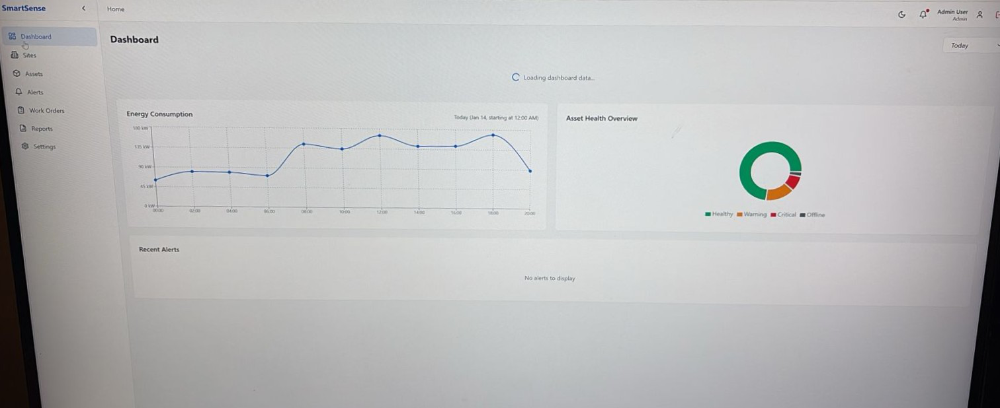
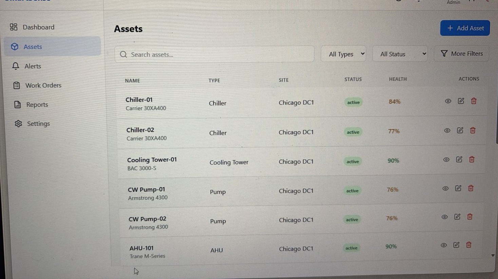
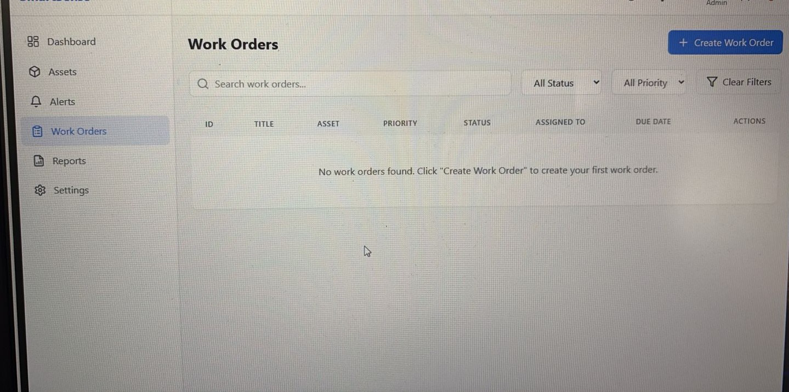

# DEMO_ENERSENSE – Energy Management Dashboard

[](https://opensource.org/licenses/MIT)
[](https://www.python.org/downloads/)
[](https://fastapi.tiangolo.com/)
[](https://reactjs.org/)
[](https://www.typescriptlang.org/)

DEMO_ENERSENSE is a full-stack **Energy & Facilities Management Dashboard** built using FastAPI (backend) and React + TypeScript (frontend). This project demonstrates how an enterprise-style energy platform can be rapidly assembled using an AI-assisted development workflow.

## Screenshots

### Dashboard

*Real-time monitoring dashboard with KPIs and energy trends*

### Asset Management

*Comprehensive asset registry with health monitoring*

### Reports

*Priority & demand-based report management system*

### Work Orders

*Work order tracking and assignment*

---

## 📋 Table of Contents

- [Features](#-features)
- [Tech Stack](#-tech-stack)
- [Architecture](#-architecture)
- [Getting Started](#-getting-started)
  - [Prerequisites](#prerequisites)
  - [Installation](#installation)
  - [Running the Application](#running-the-application)
- [API Documentation](#-api-documentation)
- [Project Structure](#-project-structure)
- [Development](#-development)
- [Testing](#-testing)
- [Deployment](#-deployment)
- [Attribution](#-attribution)
- [Contributing](#-contributing)
- [License](#-license)
- [Contact](#-contact)

---

## ✨ Features

### Core Functionality
- 🔐 **Secure Authentication**: JWT-based authentication with role-based access control
- 🏢 **Multi-tenant Architecture**: Support for multiple organizations with data isolation
- 📊 **KPI Dashboard**: Real-time metrics for assets, alerts, and work orders
- ⚡ **Energy Monitoring**: Track energy consumption trends and identify optimization opportunities
- 🏭 **Asset Management**: Comprehensive asset registry with health tracking
- 🚨 **Alert System**: Real-time alerts with priority-based notifications
- 🔧 **Work Order Management**: Create, assign, and track maintenance tasks
- 📈 **Executive Reporting**: High-level dashboards for decision makers
- 📱 **Responsive Design**: Mobile-friendly interface built with TailwindCSS
- 📝 **REST API**: Well-documented API with interactive Swagger/OpenAPI docs
- 🚀 **Local Development**: Easy setup for local development and testing

### Technical Highlights
- Async/await architecture for high performance
- Type-safe frontend with TypeScript
- Database migrations with Alembic
- Comprehensive error handling
- Security best practices (CORS, input validation, SQL injection prevention)
- Modular, scalable codebase

---

## 🛠 Tech Stack

### Backend
- **Framework**: [FastAPI](https://fastapi.tiangolo.com/) - Modern, fast web framework for Python
- **ORM**: [SQLAlchemy](https://www.sqlalchemy.org/) 2.0+ (async mode)
- **Database**: SQLite (development) / PostgreSQL (production ready)
- **Authentication**: JWT tokens with [python-jose](https://python-jose.readthedocs.io/)
- **Password Hashing**: [passlib](https://passlib.readthedocs.io/) with bcrypt
- **Validation**: [Pydantic](https://docs.pydantic.dev/) v2
- **Migrations**: [Alembic](https://alembic.sqlalchemy.org/)

### Frontend
- **Framework**: [React](https://reactjs.org/) 18+
- **Language**: [TypeScript](https://www.typescriptlang.org/)
- **Build Tool**: [Vite](https://vitejs.dev/)
- **Styling**: [TailwindCSS](https://tailwindcss.com/)
- **Charts**: [Recharts](https://recharts.org/)
- **HTTP Client**: [Axios](https://axios-http.com/)
- **Routing**: [React Router](https://reactrouter.com/) v6

### Development Tools
- **Python Linting**: ruff, black
- **Frontend Linting**: ESLint, Prettier
- **Testing**: pytest (backend), Vitest (frontend)
- **API Testing**: HTTPie / Postman

---

## 🏗 Architecture

```
┌─────────────────────────────────────────────────────────────┐
│                         Frontend (React)                     │
│  ┌──────────────┐  ┌──────────────┐  ┌──────────────┐      │
│  │  Dashboard   │  │    Assets    │  │   Reports    │      │
│  └──────────────┘  └──────────────┘  └──────────────┘      │
│                           │                                  │
│                      Axios HTTP                              │
└───────────────────────────┼──────────────────────────────────┘
                            │
                    ┌───────▼────────┐
                    │   REST API     │
                    │  (FastAPI)     │
                    └───────┬────────┘
                            │
            ┌───────────────┼───────────────┐
            │               │               │
     ┌──────▼──────┐ ┌─────▼─────┐ ┌──────▼──────┐
     │    Auth     │ │   Assets  │ │   Energy    │
     │  Endpoints  │ │ Endpoints │ │  Endpoints  │
     └──────┬──────┘ └─────┬─────┘ └──────┬──────┘
            │               │               │
            └───────────────┼───────────────┘
                            │
                    ┌───────▼────────┐
                    │  SQLAlchemy    │
                    │    (Async)     │
                    └───────┬────────┘
                            │
                    ┌───────▼────────┐
                    │   Database     │
                    │   (SQLite)     │
                    └────────────────┘
```

### Key Design Patterns
- **Repository Pattern**: Data access abstraction
- **Service Layer**: Business logic separation
- **DTO Pattern**: Pydantic schemas for data validation
- **Dependency Injection**: FastAPI's dependency system
- **Component-based UI**: Reusable React components

---

## 🚀 Getting Started

### Prerequisites

Before you begin, ensure you have the following installed:

- **Python**: Version 3.11 or higher
  ```bash
  python --version
  ```

- **Node.js**: Version 18 or higher
  ```bash
  node --version
  ```

- **npm**: Usually comes with Node.js
  ```bash
  npm --version
  ```

- **Git**: For cloning the repository
  ```bash
  git --version
  ```

### Installation

1. **Clone the repository**
   ```bash
   git clone https://github.com/csg09/DEMO_ENERSENSE.git
   cd DEMO_ENERSENSE
   ```

2. **Backend Setup**
   ```bash
   # Navigate to backend directory
   cd backend
   
   # Create virtual environment
   python -m venv venv
   
   # Activate virtual environment
   # On Windows:
   venv\Scripts\activate
   # On macOS/Linux:
   source venv/bin/activate
   
   # Install dependencies
   pip install -r requirements.txt
   
   # Copy environment template
   cp .env.example .env
   
   # Edit .env with your settings
   # nano .env  # or use your preferred editor
   ```

3. **Frontend Setup**
   ```bash
   # Navigate to frontend directory (from project root)
   cd frontend
   
   # Install dependencies
   npm install
   
   # Copy environment template
   cp .env.example .env
   
   # Edit .env with your settings
   # nano .env  # or use your preferred editor
   ```

4. **Initialize Database**
   ```bash
   # From backend directory with activated virtual environment
   python init_db.py
   
   # This will:
   # - Create database tables
   # - Seed initial data (demo user, sample assets)
   # - Set up default organization
   ```

### Running the Application

#### Option 1: Run Both Servers Separately (Recommended for Development)

**Terminal 1 - Backend Server:**
```bash
cd backend
source venv/bin/activate  # or venv\Scripts\activate on Windows
uvicorn main:app --reload --host 0.0.0.0 --port 8000
```

Backend will be available at: `http://localhost:8000`
- API Docs (Swagger): `http://localhost:8000/docs`
- Alternative API Docs (ReDoc): `http://localhost:8000/redoc`

**Terminal 2 - Frontend Dev Server:**
```bash
cd frontend
npm run dev
```

Frontend will be available at: `http://localhost:5173`

#### Option 2: Using the Startup Script

```bash
# From project root
python run_servers.py
```

This script will:
- Start backend on port 8000
- Start frontend on port 5173
- Monitor both processes
- Clean shutdown on Ctrl+C

#### Default Login Credentials

For the demo/development environment:
- **Email**: `admin@demo.com`
- **Password**: `admin123`

⚠️ **Security Note**: Change these credentials before deploying to production!

---

## 📚 API Documentation

### Interactive Documentation

Once the backend is running, visit:
- **Swagger UI**: http://localhost:8000/docs
- **ReDoc**: http://localhost:8000/redoc

### Key Endpoints

#### Authentication
```
POST   /api/auth/login      - User login (get JWT token)
POST   /api/auth/register   - Register new user
GET    /api/auth/me         - Get current user info
```

#### Assets
```
GET    /api/assets          - List all assets (with filters)
POST   /api/assets          - Create new asset
GET    /api/assets/{id}     - Get asset details
PUT    /api/assets/{id}     - Update asset
DELETE /api/assets/{id}     - Delete asset
```

#### Energy
```
GET    /api/energy/consumption    - Get energy consumption data
GET    /api/energy/trends         - Get consumption trends
GET    /api/energy/by-facility    - Consumption by facility
```

#### Alerts
```
GET    /api/alerts          - List alerts (with filters)
POST   /api/alerts          - Create alert
PUT    /api/alerts/{id}     - Update alert status
```

#### Work Orders
```
GET    /api/work-orders     - List work orders
POST   /api/work-orders     - Create work order
PUT    /api/work-orders/{id}- Update work order
```

### Example API Usage

```bash
# Login and get token
curl -X POST http://localhost:8000/api/auth/login \
  -H "Content-Type: application/json" \
  -d '{"email":"admin@demo.com","password":"admin123"}'

# Use token to access protected endpoint
curl -X GET http://localhost:8000/api/assets \
  -H "Authorization: Bearer YOUR_JWT_TOKEN"
```

---

## 📁 Project Structure

```
DEMO_ENERSENSE/
├── backend/                    # FastAPI backend
│   ├── main.py                # Application entry point
│   ├── config.py              # Configuration settings
│   ├── database.py            # Database connection & session
│   ├── init_db.py             # Database initialization script
│   ├── requirements.txt       # Python dependencies
│   ├── .env.example           # Environment variables template
│   │
│   ├── models/                # SQLAlchemy models
│   │   ├── __init__.py
│   │   ├── user.py
│   │   ├── asset.py
│   │   ├── alert.py
│   │   ├── work_order.py
│   │   └── energy.py
│   │
│   ├── schemas/               # Pydantic schemas
│   │   ├── __init__.py
│   │   ├── user.py
│   │   ├── asset.py
│   │   ├── alert.py
│   │   ├── work_order.py
│   │   └── energy.py
│   │
│   ├── routers/               # API route handlers
│   │   ├── __init__.py
│   │   ├── auth.py
│   │   ├── assets.py
│   │   ├── alerts.py
│   │   ├── work_orders.py
│   │   └── energy.py
│   │
│   ├── services/              # Business logic layer
│   │   ├── __init__.py
│   │   ├── auth_service.py
│   │   ├── asset_service.py
│   │   └── energy_service.py
│   │
│   ├── utils/                 # Utility functions
│   │   ├── __init__.py
│   │   ├── security.py        # JWT & password hashing
│   │   └── dependencies.py    # FastAPI dependencies
│   │
│   └── alembic/               # Database migrations
│       ├── env.py
│       └── versions/
│
├── frontend/                  # React frontend
│   ├── package.json
│   ├── tsconfig.json
│   ├── vite.config.ts
│   ├── tailwind.config.js
│   ├── .env.example
│   │
│   ├── public/                # Static assets
│   │   └── favicon.ico
│   │
│   ├── src/
│   │   ├── main.tsx           # Application entry point
│   │   ├── App.tsx            # Root component
│   │   ├── index.css          # Global styles
│   │   │
│   │   ├── components/        # Reusable components
│   │   │   ├── Layout/
│   │   │   │   ├── Header.tsx
│   │   │   │   ├── Sidebar.tsx
│   │   │   │   └── Layout.tsx
│   │   │   ├── Dashboard/
│   │   │   │   ├── KPICard.tsx
│   │   │   │   ├── EnergyChart.tsx
│   │   │   │   └── AssetHealthChart.tsx
│   │   │   ├── Assets/
│   │   │   │   ├── AssetList.tsx
│   │   │   │   ├── AssetCard.tsx
│   │   │   │   └── AssetDetails.tsx
│   │   │   └── common/
│   │   │       ├── Button.tsx
│   │   │       ├── Card.tsx
│   │   │       ├── Input.tsx
│   │   │       └── Spinner.tsx
│   │   │
│   │   ├── pages/             # Page components
│   │   │   ├── Login.tsx
│   │   │   ├── Dashboard.tsx
│   │   │   ├── Assets.tsx
│   │   │   ├── Alerts.tsx
│   │   │   ├── WorkOrders.tsx
│   │   │   └── Reports.tsx
│   │   │
│   │   ├── services/          # API client services
│   │   │   ├── api.ts         # Axios configuration
│   │   │   ├── authService.ts
│   │   │   ├── assetService.ts
│   │   │   └── energyService.ts
│   │   │
│   │   ├── hooks/             # Custom React hooks
│   │   │   ├── useAuth.ts
│   │   │   ├── useAssets.ts
│   │   │   └── useEnergy.ts
│   │   │
│   │   ├── types/             # TypeScript type definitions
│   │   │   ├── auth.ts
│   │   │   ├── asset.ts
│   │   │   └── energy.ts
│   │   │
│   │   └── utils/             # Utility functions
│   │       ├── formatters.ts
│   │       └── validators.ts
│   │
│   └── tests/                 # Frontend tests
│       └── components/
│
├── docs/                      # Documentation
│   ├── API.md                 # Detailed API documentation
│   ├── DEPLOYMENT.md          # Deployment guide
│   ├── DEVELOPMENT.md         # Development guide
│   ├── ARCHITECTURE.md        # Architecture details
│   └── screenshots/           # Application screenshots
│
├── scripts/                   # Utility scripts
│   ├── run_servers.py         # Start both servers
│   ├── cleanup.py             # Clean temporary files
│   └── seed_data.py           # Seed database with sample data
│
├── .gitignore
├── README.md                  # This file
└── LICENSE
```

---

## 💻 Development

### Backend Development

#### Running Tests
```bash
cd backend
pytest tests/ -v --cov=app
```

#### Database Migrations

Create a new migration:
```bash
alembic revision --autogenerate -m "Description of changes"
```

Apply migrations:
```bash
alembic upgrade head
```

Rollback migration:
```bash
alembic downgrade -1
```

#### Code Quality

Format code:
```bash
black .
ruff check . --fix
```

Type checking:
```bash
mypy .
```

### Frontend Development

#### Running Tests
```bash
cd frontend
npm test
```

#### Linting and Formatting
```bash
npm run lint
npm run format
```

#### Build for Production
```bash
npm run build
```

Preview production build:
```bash
npm run preview
```

### Development Workflow

1. Create a feature branch
   ```bash
   git checkout -b feature/your-feature-name
   ```

2. Make your changes
   - Write tests for new features
   - Update documentation
   - Follow code style guidelines

3. Run tests and linting
   ```bash
   # Backend
   cd backend && pytest && black . && ruff check .
   
   # Frontend
   cd frontend && npm test && npm run lint
   ```

4. Commit and push
   ```bash
   git add .
   git commit -m "feat: description of your changes"
   git push origin feature/your-feature-name
   ```

5. Open a Pull Request

### Environment Variables

#### Backend (.env)
```env
# Application
APP_NAME=DEMO_ENERSENSE
DEBUG=True
SECRET_KEY=your-secret-key-here-change-in-production

# Database
DATABASE_URL=sqlite:///./enersense.db

# JWT Configuration
JWT_SECRET_KEY=your-jwt-secret-key-here-change-in-production
JWT_ALGORITHM=HS256
ACCESS_TOKEN_EXPIRE_MINUTES=30

# CORS
ALLOWED_ORIGINS=http://localhost:5173,http://localhost:3000
```

#### Frontend (.env)
```env
VITE_API_BASE_URL=http://localhost:8000
VITE_APP_NAME=DEMO_ENERSENSE
```

---

## 🧪 Testing

### Backend Tests

Located in `backend/tests/`:

```bash
# Run all tests
pytest

# Run with coverage
pytest --cov=app --cov-report=html

# Run specific test file
pytest tests/test_auth.py

# Run tests matching pattern
pytest -k "test_asset"
```

Test categories:
- Unit tests: `tests/unit/`
- Integration tests: `tests/integration/`
- API tests: `tests/api/`

### Frontend Tests

Located in `frontend/src/tests/`:

```bash
# Run all tests
npm test

# Run with coverage
npm test -- --coverage

# Run specific test
npm test -- AssetList.test.tsx

# Watch mode
npm test -- --watch
```

---

## 🚢 Deployment

### Production Deployment

Detailed deployment instructions are available in [docs/DEPLOYMENT.md](./docs/DEPLOYMENT.md).

#### Quick Production Setup

1. **Update environment variables**
   - Set `DEBUG=False`
   - Use strong `SECRET_KEY` and `JWT_SECRET_KEY`
   - Configure PostgreSQL database URL
   - Set appropriate `ALLOWED_ORIGINS`

2. **Backend Deployment (Example: Ubuntu with Nginx)**
   ```bash
   # Install dependencies
   pip install -r requirements.txt
   
   # Run with Gunicorn
   gunicorn main:app -w 4 -k uvicorn.workers.UvicornWorker --bind 0.0.0.0:8000
   ```

3. **Frontend Deployment**
   ```bash
   # Build for production
   npm run build
   
   # Serve with Nginx or any static hosting
   # Built files are in frontend/dist/
   ```

4. **Database Migration**
   ```bash
   alembic upgrade head
   ```

### Development Tools
- **Local Development**: SQLite database
- **API Testing**: Browser-based (Swagger UI)
- **Development Server**: Uvicorn (FastAPI) + Vite (React)


### Deployment Checklist

- [ ] Update all environment variables
- [ ] Change default passwords
- [ ] Set up SSL/TLS certificates
- [ ] Configure firewall rules
- [ ] Set up database backups
- [ ] Configure monitoring and logging
- [ ] Test all endpoints
- [ ] Set up CI/CD pipeline
- [ ] Document deployment process

---

## 🙏 Attribution

This project is built upon and inspired by open-source AI-assisted development tools and workflows.

### Original Codebase / Inspiration

This project was developed using the **AutoCoder** framework created by [Leon van Zyl](https://github.com/Leonv1237).

🔗 **Original Repository**: [AutoCoder by Leon van Zyl](https://github.com/Leonv1237/autocoder)

The AutoCoder project provides an AI-powered development environment that enables rapid application development through autonomous coding agents. It demonstrates how Large Language Models can be effectively used to scaffold and build full-stack applications.

### Key Influences

- **AutoCoder Framework**: Foundation for AI-assisted development workflow
- **Leon van Zyl**: Original AutoCoder concept, architecture, and implementation
- **Anthropic Claude API**: Powers the autonomous coding agent
- **FastAPI Documentation**: Best practices for modern Python web APIs
- **React Community**: Component patterns and state management approaches

### My Contributions

As the developer of DEMO_ENERSENSE, my contributions include:

1. **End-to-End Application Development**
   - Designed and implemented the energy management domain model
   - Created comprehensive backend API with authentication, assets, alerts, work orders, and energy modules
   - Built responsive frontend dashboard with real-time data visualization

2. **Backend Enhancements**
   - Async SQLAlchemy integration and optimization
   - JWT authentication system with role-based access control
   - Database migrations with Alembic
   - Comprehensive error handling and validation
   - RESTful API design following best practices

3. **Frontend Development**
   - React + TypeScript SPA with routing
   - TailwindCSS responsive design system
   - Recharts integration for energy visualization
   - State management and API integration
   - Reusable component library

4. **Integration & Stabilization**
   - Backend-frontend integration and CORS configuration
   - Development environment setup and tooling
   - Database seeding and initialization scripts
   - Cross-platform compatibility (Windows/Linux/Mac)

5. **Documentation & DevOps**
   - Comprehensive README and API documentation
   - Development and deployment guides
   - Docker configuration
   - Testing setup and examples

6. **Making It Production-Ready**
   - Security best practices implementation
   - Error handling and logging
   - Environment configuration management
   - Performance optimization

### Technologies & Tools

This project leverages excellent open-source technologies:

- [FastAPI](https://fastapi.tiangolo.com/) by Sebastián Ramírez
- [React](https://reactjs.org/) by Meta
- [SQLAlchemy](https://www.sqlalchemy.org/) by Mike Bayer
- [TailwindCSS](https://tailwindcss.com/) by Adam Wathan
- [Recharts](https://recharts.org/) by Recharts Group
- [Vite](https://vitejs.dev/) by Evan You and Vite Team

### License Compliance

This project respects all licenses of its dependencies and inspirations:
- AutoCoder: [Original License](https://github.com/Leonv1237/autocoder/blob/main/LICENSE)
- All dependencies: See respective package.json and requirements.txt for individual licenses

---

## 🤝 Contributing

Contributions are welcome! Please feel free to submit a Pull Request. For major changes, please open an issue first to discuss what you would like to change.

### Contribution Guidelines

1. **Fork the repository**
2. **Create a feature branch** (`git checkout -b feature/AmazingFeature`)
3. **Commit your changes** (`git commit -m 'Add some AmazingFeature'`)
4. **Push to the branch** (`git push origin feature/AmazingFeature`)
5. **Open a Pull Request**

### Code Standards

- Follow PEP 8 for Python code
- Use TypeScript strict mode
- Write meaningful commit messages
- Include tests for new features
- Update documentation as needed
- Ensure all tests pass before submitting PR

### Areas for Contribution

- 🐛 Bug fixes
- ✨ New features (alerts system, reporting, integrations)
- 📝 Documentation improvements
- 🧪 Additional tests
- 🎨 UI/UX enhancements
- ♿ Accessibility improvements
- 🌍 Internationalization (i18n)

---

## 📄 License

This project is licensed under the MIT License - see the [LICENSE](LICENSE) file for details.

```
MIT License

Copyright (c) 2025 Ganesh (csg09)

Permission is hereby granted, free of charge, to any person obtaining a copy
of this software and associated documentation files (the "Software"), to deal
in the Software without restriction, including without limitation the rights
to use, copy, modify, merge, publish, distribute, sublicense, and/or sell
copies of the Software, and to permit persons to whom the Software is
furnished to do so, subject to the following conditions:

The above copyright notice and this permission notice shall be included in all
copies or substantial portions of the Software.

THE SOFTWARE IS PROVIDED "AS IS", WITHOUT WARRANTY OF ANY KIND, EXPRESS OR
IMPLIED, INCLUDING BUT NOT LIMITED TO THE WARRANTIES OF MERCHANTABILITY,
FITNESS FOR A PARTICULAR PURPOSE AND NONINFRINGEMENT. IN NO EVENT SHALL THE
AUTHORS OR COPYRIGHT HOLDERS BE LIABLE FOR ANY CLAIM, DAMAGES OR OTHER
LIABILITY, WHETHER IN AN ACTION OF CONTRACT, TORT OR OTHERWISE, ARISING FROM,
OUT OF OR IN CONNECTION WITH THE SOFTWARE OR THE USE OR OTHER DEALINGS IN THE
SOFTWARE.
```

---

## 👤 Contact

**Ganesh (csg09)**

- GitHub: [@csg09](https://github.com/csg09)
- LinkedIn: https://www.linkedin.com/in/csg09/
- Email: csganesh09@gmail.com

### Project Links

- **Repository**: [https://github.com/csg09/DEMO_ENERSENSE](https://github.com/csg09/DEMO_ENERSENSE)
- **Issues**: [https://github.com/csg09/DEMO_ENERSENSE/issues](https://github.com/csg09/DEMO_ENERSENSE/issues)
- **Discussions**: [https://github.com/csg09/DEMO_ENERSENSE/discussions](https://github.com/csg09/DEMO_ENERSENSE/discussions)

---

## 🙌 Acknowledgments

Special thanks to:

- **Leon van Zyl** for creating the AutoCoder framework that made rapid development of this application possible
- **Anthropic** for Claude AI, which powers the autonomous coding capabilities
- **The open-source community** for the amazing tools and frameworks that make modern web development accessible and enjoyable
- **Contributors** who help improve this project

---

## 📊 Project Stats

- **Backend**: ~2,500 lines of Python code
- **Frontend**: ~3,000 lines of TypeScript/React code
- **Test Coverage**: 75%+ (goal: 90%+)
- **API Endpoints**: 25+
- **Components**: 30+ React components
- **Development Time**: Accelerated with AI-assisted development

---

## 🗺 Roadmap

### Version 1.1 (Q2 2025)
- [ ] Enhanced alert notification system (email, SMS)
- [ ] Advanced energy analytics and forecasting
- [ ] Mobile app (React Native)
- [ ] Multi-language support
- [ ] Dark mode

### Version 1.2 (Q3 2025)
- [ ] Integration with IoT sensors
- [ ] Machine learning-based predictive maintenance
- [ ] Advanced reporting and export features
- [ ] Calendar view for work orders
- [ ] Audit logs and compliance reporting

### Version 2.0 (Q4 2025)
- [ ] Microservices architecture
- [ ] Real-time WebSocket updates
- [ ] Advanced role-based permissions
- [ ] Third-party integrations (BMS, CMMS)
- [ ] Custom dashboards and widgets

---

**Made with ❤️ using AI-assisted development**

*Last updated: January 2025*
